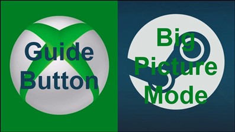

<!-- Improved compatibility of back to top link: See: https://github.com/othneildrew/Best-README-Template/pull/73 -->
<a name="readme-top"></a>
<!--
*** Thanks for checking out the Best-README-Template. If you have a suggestion
*** that would make this better, please fork the repo and create a pull request
*** or simply open an issue with the tag "enhancement".
*** Don't forget to give the project a star!
*** Thanks again! Now go create something AMAZING! :D
-->

<!-- PROJECT SHIELDS -->
<!--
*** I'm using markdown "reference style" links for readability.
*** Reference links are enclosed in brackets [ ] instead of parentheses ( ).
*** See the bottom of this document for the declaration of the reference variables
*** for contributors-url, forks-url, etc. This is an optional, concise syntax you may use.
*** https://www.markdownguide.org/basic-syntax/#reference-style-links

[![Contributors][contributors-shield]][contributors-url]
[![Forks][forks-shield]][forks-url]
[![Stargazers][stars-shield]][stars-url]
[![Issues][issues-shield]][issues-url]
[![MIT License][license-shield]][license-url]
-->
<!-- PROJECT LOGO -->

<div align="center">
    <a href="[https://github.com/CriticalPoint/Remove-Steam-Guide-Button-Bind---Disable-Big-Picture-Mode](https://github.com/CriticalPoint/Remove-Steam-Guide-Button-Bind---Disable-Big-Picture-Mode?readme=1#readme-top)">
    
    <br>
    <h3 align="center">Stop Steam Big Picture Mode (BPM) taking over your controllers Home (Guide) button</h4>
  </a>
  <br>
  <h3 align="center">Sorry but I took a break from this as it became more complex. I have now finished with the automation part, and you can read on to see how to configure the script to automatically run a few seconds after Steam has loaded up</h3>
  <br>
  <br>
    <p align="center">
    Annoyed by Steam forcing Big Picture Mode when I press my Xbox Guide button (as you may be too, since you're here), I started about creating a 'set and forget' script for my PC.
    <br>
    <br>
    I did some digging to find out what's happening with Steam and the Guide assignment and arrived at something that, hopefully, everyone can make use of in their own way - a simple PowerShell script that removes all Guide button bindings when the Steam Client loads.
    <br>
    <br>
    Explore the code and decide if it's for you. Ask questions, fork, chop, poke, chew it up, and/or spit it out, it is yours to do with what you will.
  </p>
</div>


<!-- Why -->
# Why

You press your Guide button to access Xbox Game Bar (for example) and BAM, Big Picture Mode from nowhere.

You've tried disable it, you've toggled different things off, then on, and back to off but you're getting nowhere... "*Why isn't it working, what am I doing wrong?*"

You've been set-up to fail as Steam re-maps that button at launch and again at exit. It does it a bunch of other times, too (when opening specific option pages), and it just keeps coming back.

It's not you, so you don't need to be forgiven for thinking that switching off a comedy-sized, giant button in the settings menu that says "Guide button focuses Steam", might actually work because, well, no, it doesn't.


# How it does it
Targeting the SDL config directly ('*guide*' is a non-Steam assignment so unlikely to ever change), the script removes all bindings (from all controllers) in your settings.
It doesn't matter if you're using a PlayStation, Xbox, Nintendo, aftermarket, off-brand or other controller - the Guide button will no longer be bound (in Steam) after the file runs.

*Everything else is unaffected, Game Bar will still work as normal - it's just the Guide button assignment withint Steam that gets unmapped*


<!-- PREREQUISITES -->
# Prerequisites

You'll need PowerShell (>v7) to use this script. To check, open up PowerShell and run the below to find your version:
```
$PSVersionTable
```
If you don't have PowerShell 7, see [Installing PowerShell on Windows](https://learn.microsoft.com/en-us/powershell/scripting/install/installing-powershell-on-windows)


<!-- USAGE -->
# Usage
## The script automatically finds your config
Grab [Guide Unbind - Default Steam Install Location.ps1](https://github.com/CriticalPoint/Remove-Steam-Guide-Button-Bind---Disable-Big-Picture-Mode/blob/main/1%20-%20PS%20SCRIPTS/Guide%20Unbind%20-%20Default%20Steam%20Install%20Location.ps1).

Open Steam and, after a few seconds, run the script. You'll likely have to adjust your execution policy - _Set-ExecutionPolicy Unrestricted_. Read about [PowerShell execution policy](https://learn.microsoft.com/en-us/powershell/module/microsoft.powershell.security/set-executionpolicy?view=powershell-7.3).


As promised, your install DIR is now detected automatically, provided Steam is installed somewhere on C:\

If it isn't on C: you can just edit the script (line 11), changing "C:\" to the correct drive you have Steam installed.

So "D:\", or "E:\" for example...


<!-- Automation -->
## Automation
Run the script some time after Steam fires up - four seconds works for me although YMMV. Some say Steam takes a little longer to open; adjust according to your system (default is set to 8).

Follow along to:
- Configure a *Scheduled Task* and have an admin account available for the task to run under.
- Enable [Audit process tracking](https://learn.microsoft.com/en-us/windows/security/threat-protection/auditing/basic-audit-process-tracking), setting audit 'Success' and 'Failure' flags in the Security Policy.
```Computer Configuration  -->  Windows Setting  -->  Security Settings  -->  Local Policies  -->  Audit Policy  -->  Audit Process Tracking```, configure and enable both *success* and *failure*

When you're ready, either use the included template, or create your own task [Manually](https://github.com/CriticalPoint/Remove-Steam-Guide-Button-Bind---Disable-Big-Picture-Mode#set-the-trigger)

# Automatically
 [Use the included template](https://github.com/CriticalPoint/Remove-Steam-Guide-Button-Bind---Disable-Big-Picture-Mode/blob/main/Scheduled%20Tasks/Remove%20Steam%20Guide-button%20Assignments.xml) to create your own Scheduled Task.
 
 Update it to match your own settings and import it into Task Scheduler...
  - `<Author>` - change this to your PC name and Username (<Author>COMPUTERNAME-CHANGE\ME</Author>). Use `whoami` in CMD to easily get it.
  - `<UserId>` - Your *S-1-123456789....* number. Use `wmic useraccount get name,sid` in CMD to easily get it.
  - `<Arguments>` - Your path to the PowerShell Script `<Arguments>-ExecutionPolicy Unrestricted -WindowStyle Hidden -File "**C:\PATH TO SCRIPT\Guide Unbind - Default Steam Install Location.ps1**"</Arguments>`

# Manually
Create the task yourself, here's how...

### 1. Set the Trigger
(*Triggers* > *On an Event* > *Custom* > *XML*)

```
<QueryList>
  <Query Id="0" Path="Application">
    <Select Path="Application">
    *[System[Provider[@Name='Application'] and (Level=4 or Level=0) and (EventID=4688)]]
    and 
     *[EventData[Data[@Name='NewProcessName'] and (Data='**C:\Program Files (x86)\Steam\steam.exe**')]]
     </Select>
  </Query>
</QueryList>
```


### 2. Set the Action
(*TS/Actions* > *Start a Program*)

'Program/Script'  ```pwsh```

'Arguments'  ```-ExecutionPolicy Unrestricted -WindowStyle Hidden -File "C:\PS\Guide Unbind - Default Steam Install Location.ps1"```

*This assumes the location of the script is in a folder named 'PS', on the root of C: - Update path as necessary!*


### 3. Configure the Settings
Specify these additional settings (and their values), not that *almost* but not all of the options are checked.

- [X] Allow task to be run on demand
- [X] Run task as soon as possible after a scheduled start is missed
- [X] If the task fails, restart every: *1 Minute*
- [X] Attempt to restart up to: *3 times*
- [X] Stop the task if it runs longer than: *1 hour*
- [X] If the running task does not end when requested, force it to stop
- [ ] If the task is not scheduled to run again, delete it after: ❌ (Unchecked)
- [X] If the task is already running, then the following rule applies: *Stop the existing instance*

A full set of reference screenshots are available (CTRL+click to open each in a new tab) - [General](images/taskScheduler/General.png) - [Triggers](images/taskScheduler/Triggers.png) - [Actions](images/taskScheduler/Actions.png) - [Conditions](images/taskScheduler/Conditions.png) - [Settings](images/taskScheduler/Settings.png)


### 4. Save!


You can verify the success of this by first disabling the Task and testing your Guide button in Steam. It should enter BPM.

Now exit Steam, re-enable the Task you just created, open Steam and test it again. BPM should be a thing of the past. If for whatever reason BPM opens at this point, please [Raise an Issue](https://github.com/CriticalPoint/Remove-Steam-Guide-Button-Bind---Disable-Big-Picture-Mode/issues) and I will help you get set up. If issues aren't for you and you still need help, you can optionally drop into [Discussions](https://github.com/CriticalPoint/Remove-Steam-Guide-Button-Bind---Disable-Big-Picture-Mode/discussions) and ask for help there.


<!-- What Changes -->
## Changes to the output file

You'll find both copies of the config.vdf in the [diff check of config.vfd](https://github.com/CriticalPoint/Remove-Steam-Guide-Button-Bind---Disable-Big-Picture-Mode/tree/main/diff%20check%20of%20config.vfd) folder - *before-config.vdf*, and *after-config.vdf*.

The final Diff Check (minus all my personal info) is also available, here [Remove all Guide button binds (guide:bxx) from 'config.vdf'](https://www.diffchecker.com/TxvnAz0R/)


<!-- CONTRIBUTING -->
## Contributing

Contributions are what make the open source community such an amazing place to learn, inspire, and create. Any contributions you make are more than welcome, and **greatly appreciated**.

If you have a suggestion that would make this Repo better then please do contribute by either forking the repo and creating a pull request, joining in with [discussions](https://github.com/CriticalPoint/Remove-Steam-Guide-Button-Bind---Disable-Big-Picture-Mode/discussions), or opening an issue with the "enhancement" tag - whatever works for you 🙏🏻

Don't forget to give the project a star! Thanks again!


<!-- Bugs -->
## Issues and Bugs!

🪲 Discovered a bug? Please [open a Bug report](https://github.com/CriticalPoint/Remove-Steam-Guide-Button-Bind---Disable-Big-Picture-Mode/issues/new?assignees=CriticalPoint&labels=&projects=&template=bug_report.md&title=) so that I can fix/polish/improve it!


<!-- Disclaimer -->
## Disclaimer
<a name="disclaimer"></a>
This software is provided as-is and, although I have tested it on my machine, a couple of test VM's, in Windows Sandbox, and on my unsuspecting mates' PC, I'm afraid that I cannot accept any liability for 'damages', howsoever caused. Please understand that by using this software you do so at your own risk, and that constitutes your acceptance of the fact that I am not responsible for anything that has happened in the past by not using it, anything that may happen as a result of using it now, or by either using it, or not, in future - it's ultimately up to you if you choose to use it, regardless of how awesome it is 🙏🏻


<!-- CONTACT -->
## Contact

Reach me via [Discussions](https://github.com/CriticalPoint/Remove-Steam-Guide-Button-Bind---Disable-Big-Picture-Mode/discussions), if you need me! 👍🏻

Project Link: [CriticalPoint/Remove-Steam-Guide-Button-Bind---Disable-Big-Picture-Mode](https://github.com/CriticalPoint/Remove-Steam-Guide-Button-Bind---Disable-Big-Picture-Mode)


<!-- LICENSE -->
## License

Distributed under the MIT License. See `LICENSE.txt` for more information.

<p align="right">(<a href="#readme-top">back to top</a>)</p>
